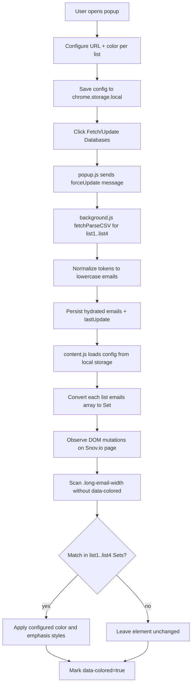

# Snov.io Runtime Logging & Highlighting Library

A deterministic, zero-backend logging-and-annotation runtime for Snov.io that ingests remote email datasets and applies real-time, color-coded status signals directly in the UI.

[](manifest.json)
[](manifest.json)
[](LICENSE)
[](#6-testing)
[](#6-testing)

> [!NOTE]
> Although distributed as a Chrome Extension, the `content.js` execution model behaves like a lightweight in-page logging library: normalize input, classify entities, and apply deterministic output formatting.

## 2. Table of Contents

- [1. Title and Description](#snovio-runtime-logging--highlighting-library)
- [2. Table of Contents](#2-table-of-contents)
- [3. Features](#3-features)
- [4. Tech Stack & Architecture](#4-tech-stack--architecture)
- [5. Getting Started](#5-getting-started)
- [6. Testing](#6-testing)
- [7. Deployment](#7-deployment)
- [8. Usage](#8-usage)
- [9. Configuration](#9-configuration)
- [10. License](#10-license)
- [11. Contacts & Community Support](#11-contacts--community-support)

## 3. Features

- Real-time email status annotation on `https://app.snov.io/*` via a Manifest V3 content script.
- Runtime ingestion of up to **four independent datasets** from remote CSV-compatible URLs.
- Flexible multi-list classification with **per-list custom color mapping** (`list1..list4`).
- Deterministic first-match precedence model: the first configured list containing an email determines its visual classification.
- In-memory O(1) lookup by converting source email arrays into `Set` collections.
- Normalization pipeline (`trim()` + `toLowerCase()`) to avoid case and whitespace mismatch.
- Debounced DOM mutation processing (`MutationObserver` + timeout) to reduce rendering overhead in dynamic pages.
- Idempotent processing using `data-colored="true"` to avoid repeated style mutations.
- Local persistence with `chrome.storage.local` for URLs, colors, hydrated dataset caches, and `lastUpdate` timestamp.
- Operator-friendly popup control plane for saving source URLs and manually triggering updates.
- No backend service, no API key management, and no telemetry dependency by default.

> [!IMPORTANT]
> This extension only processes elements matching `.long-email-width`. If Snov.io changes its DOM contract, classification will stop until the selector is updated.

## 4. Tech Stack & Architecture

### Core Technologies

- **Language:** Vanilla JavaScript (ES6)
- **Runtime:** Chrome Extension (Manifest V3)
- **UI Surface:** `popup.html` + `popup.js`
- **Background Processing:** `background.js` service worker
- **In-page Engine:** `content.js`
- **Persistence:** `chrome.storage.local`
- **External Data Sources:** HTTP(S) CSV/plaintext endpoints (e.g., published Google Sheets)

### Project Structure

<details>
<summary>Expand full repository tree</summary>

```text
.
├── background.js           # Fetch/update orchestration + storage hydration
├── content.js              # In-page classifier and visual annotator
├── popup.html              # Operator UI for source URL/color configuration
├── popup.js                # Popup state management + update actions
├── manifest.json           # Extension metadata, permissions, script wiring
├── email_fail.txt          # Legacy/local dataset artifact
├── email_true.txt          # Legacy/local dataset artifact
├── emails.txt              # Auxiliary local list artifact
├── icons/
│   └── icon128.png         # Extension icon
├── CONTRIBUTING.md
├── SECURITY.md
├── LICENSE
└── README.md
```

</details>

### Key Design Decisions

- **Control plane/data plane split:**
  - `popup.js` handles operator input and command dispatch.
  - `background.js` handles network retrieval and storage updates.
  - `content.js` performs deterministic runtime evaluation against hydrated config.
- **Data-local runtime:** remote URLs are fetched only during explicit update actions, then cached locally.
- **Selector-scoped mutation:** only unprocessed email nodes are evaluated.
- **Static style mutation:** direct inline styles avoid CSS class dependency and simplify runtime portability.
- **Fail-soft fetch model:** invalid URLs or fetch failures resolve to empty datasets to keep extension usable.

<details>
<summary>Mermaid diagram: end-to-end logging/classification pipeline</summary>



</details>

> [!TIP]
> For large datasets, prefer pre-cleaned sources with one email token per cell/line to minimize client-side parsing overhead.

## 5. Getting Started

### Prerequisites

- Google Chrome (latest stable recommended)
- Access to `https://app.snov.io/*`
- `git`
- Optional local tooling for validation:
  - Node.js `>=18`
  - Python `>=3.8`

### Installation

```bash
git clone https://github.com/OstinUA/Snov.io-addon_1.git
cd Snov.io-addon_1
```

1. Open `chrome://extensions/`.
2. Enable **Developer mode**.
3. Click **Load unpacked**.
4. Select the repository root.
5. Open extension popup and configure up to four source URLs and colors.
6. Click **Save Settings**.
7. Click **Fetch / Update Databases**.
8. Refresh Snov.io tab.

> [!WARNING]
> Source URLs must be publicly readable from the browser context and return plain text/CSV-friendly content. Auth-gated or blocked responses will yield empty lists.

<details>
<summary>Troubleshooting and alternative setup paths</summary>

### Troubleshooting

- **No highlights appear**
  - Verify URLs are valid and return content with `@` tokens.
  - Re-run **Fetch / Update Databases** and confirm `Last update` changes.
  - Confirm the target page is under `https://app.snov.io/*`.

- **Colors saved but not applied**
  - Ensure the email exists in one of the fetched datasets.
  - Confirm element selector `.long-email-width` still exists in current Snov.io DOM.

- **Fetch succeeds but results seem stale**
  - Clear extension storage or update source content and fetch again.

### Building from source (packaged zip)

```bash
rm -rf dist && mkdir -p dist/snov-addon
cp -R manifest.json background.js content.js popup.html popup.js icons LICENSE README.md dist/snov-addon/
cd dist && zip -r snov-addon.zip snov-addon
```

</details>

## 6. Testing

This project currently uses script-level validation and manual integration checks.

### Automated/CLI checks

```bash
node --check content.js
node --check popup.js
node --check background.js
python3 -m json.tool manifest.json > /dev/null
git status --short
```

### Manual integration test protocol

1. Configure at least one URL with known emails and assign a visible color.
2. Trigger **Fetch / Update Databases** from popup.
3. Open a Snov.io page with target contacts.
4. Verify matching addresses are highlighted with configured colors.
5. Verify non-matching addresses remain unchanged.
6. Update source data and repeat to validate refresh behavior.

> [!CAUTION]
> There is no isolated unit-test harness in this repository today; all behavioral validation is runtime/manual.

## 7. Deployment

### Production deployment model

- **Primary mode:** unpacked extension for internal team usage.
- **Secondary mode:** zipped extension artifact for controlled distribution.

### CI/CD recommendations

- Add a validation stage:
  - JavaScript syntax checks for all runtime files.
  - `manifest.json` schema sanity (`json.tool` at minimum).
- Add packaging stage:
  - Build zip artifact on tagged commits.
- Add release governance:
  - Semantic version bump in `manifest.json`.
  - Release notes summarizing config or runtime behavior changes.

<details>
<summary>Example CI skeleton (pseudo-workflow)</summary>

```yaml
name: validate-and-package
on:
  push:
    tags: ['v*']
  pull_request:

jobs:
  validate:
    runs-on: ubuntu-latest
    steps:
      - uses: actions/checkout@v4
      - run: node --check content.js
      - run: node --check popup.js
      - run: node --check background.js
      - run: python3 -m json.tool manifest.json > /dev/null

  package:
    needs: validate
    runs-on: ubuntu-latest
    steps:
      - uses: actions/checkout@v4
      - run: |
          mkdir -p dist/snov-addon
          cp -R manifest.json background.js content.js popup.html popup.js icons LICENSE README.md dist/snov-addon/
          cd dist && zip -r snov-addon.zip snov-addon
```

</details>

## 8. Usage

### Basic usage

```js
// content.js: list data is hydrated from chrome.storage.local (set by popup/background)
let listsData = [];

chrome.storage.local.get(['config'], (result) => {
  const config = result.config;

  if (config) {
    if (config.list1?.emails) listsData.push({ emails: new Set(config.list1.emails), color: config.list1.color });
    if (config.list2?.emails) listsData.push({ emails: new Set(config.list2.emails), color: config.list2.color });
    if (config.list3?.emails) listsData.push({ emails: new Set(config.list3.emails), color: config.list3.color });
    if (config.list4?.emails) listsData.push({ emails: new Set(config.list4.emails), color: config.list4.color });
  }

  initObserver();
});

function highlightEmails() {
  // Process only unhandled email nodes
  const elements = document.querySelectorAll('.long-email-width:not([data-colored="true"])');

  elements.forEach((el) => {
    const normalizedEmail = el.textContent.trim().toLowerCase();
    let matchedColor = null;

    // First-match precedence across list1..list4
    for (let i = 0; i < listsData.length; i++) {
      if (listsData[i].emails?.has(normalizedEmail)) {
        matchedColor = listsData[i].color;
        break;
      }
    }

    if (matchedColor) {
      el.style.backgroundColor = matchedColor;
      el.style.color = '#000000';
      el.style.fontWeight = 'bold';
      el.style.padding = '2px 5px';
      el.style.borderRadius = '4px';
    }

    // Mark idempotently so repeated mutation cycles are cheap
    el.dataset.colored = 'true';
  });
}
```

<details>
<summary>Advanced usage: custom list precedence and operational patterns</summary>

### Custom precedence strategy

Order in `listsData` defines matching precedence. To prioritize “replied” over “failed” semantics:

1. Bind replied source to `list1`.
2. Bind failed source to `list2`.
3. Keep lower-priority categories in `list3`/`list4`.

### Edge cases and behavior guarantees

- Duplicate emails across multiple lists resolve by first-match rule.
- Empty URL or invalid URL resolves to empty dataset without crash.
- Any token containing `@` is accepted as candidate email during fetch parse.
- Existing `data-colored="true"` nodes are skipped in later scans.

### Custom formatter strategy

Current formatter is inline-style based. For stricter theming control, adapt runtime to:

- assign semantic classes (e.g., `email-status--hot`) instead of inline colors,
- inject a style sheet once per page,
- keep `data-colored` marker for idempotence.

</details>

## 9. Configuration

### Runtime configuration model

The extension stores a `config` object in `chrome.storage.local`:

- `list1..list4.url` – remote source URL
- `list1..list4.color` – highlight color (`#RRGGBB`)
- `list1..list4.emails` – hydrated normalized email array
- `lastUpdate` – local timestamp string

> [!NOTE]
> This project does not currently require `.env` files, startup CLI flags, or server-side configuration.

### Manifest-level options

| Key | Location | Purpose |
|---|---|---|
| `permissions: ["storage"]` | `manifest.json` | Enables local persistent configuration and datasets |
| `host_permissions` | `manifest.json` | Grants runtime access to Snov.io and configured docs domains |
| `content_scripts.matches` | `manifest.json` | Restricts injection scope to `https://app.snov.io/*` |
| `content_scripts.run_at` | `manifest.json` | Sets injection phase to `document_end` |

<details>
<summary>Exhaustive config reference and default schema</summary>

### Default config shape (logical)

```json
{
  "config": {
    "list1": { "url": "", "color": "#f65353", "emails": [] },
    "list2": { "url": "", "color": "#ffeb3b", "emails": [] },
    "list3": { "url": "", "color": "#7dff7d", "emails": [] },
    "list4": { "url": "", "color": "#53a8f6", "emails": [] },
    "lastUpdate": null
  }
}
```

### Configuration options table

| Field | Type | Default | Source | Notes |
|---|---|---|---|---|
| `config.list1.url` | `string` | `""` | popup input | If empty/invalid, fetch returns `[]` |
| `config.list1.color` | `string` | `#f65353` | popup color picker | Applied to first list matches |
| `config.list1.emails` | `string[]` | `[]` | background fetch | Normalized lowercase |
| `config.list2.url` | `string` | `""` | popup input | Same behavior as list1 |
| `config.list2.color` | `string` | `#ffeb3b` | popup color picker | Lower priority than list1 |
| `config.list2.emails` | `string[]` | `[]` | background fetch | Converted to `Set` in content script |
| `config.list3.url` | `string` | `""` | popup input | Optional category |
| `config.list3.color` | `string` | `#7dff7d` | popup color picker | Third precedence |
| `config.list3.emails` | `string[]` | `[]` | background fetch | Converted to `Set` in content script |
| `config.list4.url` | `string` | `""` | popup input | Optional category |
| `config.list4.color` | `string` | `#53a8f6` | popup color picker | Fourth precedence |
| `config.list4.emails` | `string[]` | `[]` | background fetch | Converted to `Set` in content script |
| `config.lastUpdate` | `string \| null` | `null` | background service worker | UI informational only |

### Environment variables and startup flags

- `.env`: not used
- CLI startup flags: not used
- Server bootstrap config: not applicable

</details>

## 10. License

Distributed under the **GNU General Public License v2.0**. See `LICENSE` for full terms.

## 11. Contacts & Community Support

## Support the Project

[](https://www.patreon.com/OstinFCT)
[](https://ko-fi.com/fctostin)
[](https://boosty.to/ostinfct)
[](https://www.youtube.com/@FCT-Ostin)
[](https://t.me/FCTostin)

If you find this tool useful, consider leaving a star on GitHub or supporting the author directly.
