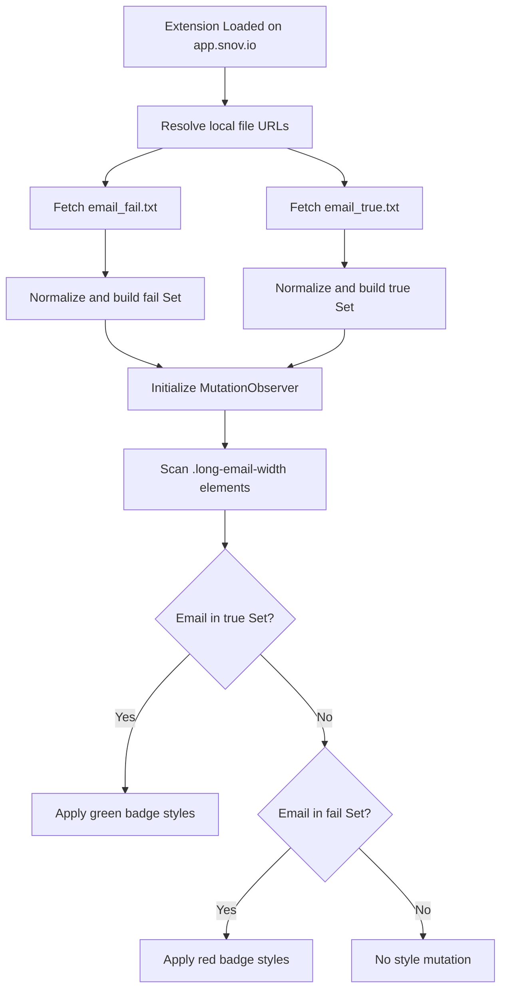

# Snov.io Addon: Status Highlighter

A zero-backend Chrome Extension logging-style status highlighter for Snov.io that classifies outreach emails from local datasets and renders deterministic visual markers in real time.

[](https://github.com/OstinUA/Snov.io-addon_1)
[](https://github.com/OstinUA/Snov.io-addon_1)
[](https://github.com/OstinUA/Snov.io-addon_1)
[](LICENSE)

> [!NOTE]
> Although this repository is a browser extension, its behavior follows a lightweight logging-library pattern: local source ingestion, normalization, deterministic lookup, and event-driven rendering.

## Table of Contents

- [Features](#features)
- [Tech Stack & Architecture](#tech-stack--architecture)
  - [Core Stack](#core-stack)
  - [Project Structure](#project-structure)
  - [Key Design Decisions](#key-design-decisions)
- [Getting Started](#getting-started)
  - [Prerequisites](#prerequisites)
  - [Installation](#installation)
- [Testing](#testing)
- [Deployment](#deployment)
- [Usage](#usage)
- [Configuration](#configuration)
- [License](#license)
- [Contacts & Community Support](#contacts--community-support)

## Features

- Manifest V3 compliant extension architecture with scoped host permissions (`https://app.snov.io/*`).
- Dual-source status ingestion using newline-delimited local files:
  - `email_fail.txt` for failed/risky recipients.
  - `email_true.txt` for replied recipients.
- Fast in-memory classification using `Set` collections for constant-time average lookup.
- Case-insensitive normalization pipeline (`trim().toLowerCase()`) to prevent case drift.
- Mutation-driven runtime processing with debounce to support dynamic DOM updates.
- Deterministic precedence model where reply status overrides fail status if duplicated.
- Minimal operational footprint: no remote API, no backend runtime, no telemetry channel.
- Safe runtime scoping via `web_accessible_resources` and host match restrictions.

> [!IMPORTANT]
> Status files are treated as source-of-truth datasets. Keep one email per line and avoid extra delimiters to preserve predictable matching.

## Tech Stack & Architecture

### Core Stack

- Language: Vanilla JavaScript (ES6)
- Runtime Model: Chrome Extension (Manifest V3)
- Browser APIs:
  - `chrome.runtime.getURL` for local resource addressing
  - `fetch` for loading local text datasets
  - `MutationObserver` for dynamic page observation
- Data Format: Plain text (`.txt`) lists, newline-delimited

### Project Structure

```text
.
├── content.js         # Core load/normalize/lookup/highlight pipeline
├── manifest.json      # MV3 metadata, permissions, content script wiring
├── email_fail.txt     # Failure/risk dataset (red highlight)
├── email_true.txt     # Replied dataset (green highlight)
├── emails.txt         # Supplemental email list (optional local data)
├── icons/
│   └── icon128.png    # Extension icon asset
├── README.md
└── LICENSE
```

### Key Design Decisions

1. Local-only data ingestion
   - Chosen to avoid network latency, API failures, and privacy concerns.
   - Ensures predictable behavior in offline-constrained enterprise environments.

2. Set-backed indexing
   - Email lookups are performed against `Set` instances to reduce repeated scan overhead.
   - Suitable for large outreach datasets compared with array `.includes()` loops.

3. Debounced mutation handling
   - Dynamic Snov.io UI changes are observed continuously.
   - Debounce window limits excessive re-processing during rapid DOM churn.

4. CSS inline rendering
   - Visual style is applied directly on target nodes.
   - Reduces dependency on external stylesheets and keeps extension packaging simple.



> [!TIP]
> If your outreach volume is high, periodically de-duplicate status files to keep load times and memory footprint lean.

## Getting Started

### Prerequisites

- Chromium-based browser (Google Chrome recommended)
- Access to `https://app.snov.io/*`
- Git installed locally
- Text editor for updating status datasets

### Installation

```bash
# 1) Clone repository
git clone https://github.com/OstinUA/Snov.io-addon_1.git
cd Snov.io-addon_1

# 2) Populate local status datasets (one email per line)
# edit email_fail.txt
# edit email_true.txt

# 3) Load unpacked extension
# open chrome://extensions/
# enable "Developer mode"
# click "Load unpacked" and select this repository directory
```

> [!WARNING]
> Reload the extension after modifying `email_fail.txt` or `email_true.txt`; active tabs do not automatically reload local assets.

## Testing

This project has no formal automated unit/integration suite in the current repository state. Use the following validation workflow:

```bash
# Static sanity checks
node --check content.js
python -m json.tool manifest.json > /tmp/manifest.pretty.json

# Manual runtime verification
# 1) Load extension in chrome://extensions/
# 2) Open https://app.snov.io/
# 3) Confirm replied emails render green
# 4) Confirm failed emails render red
# 5) Confirm duplicated emails prefer green (reply precedence)
```

> [!CAUTION]
> `node --check` validates syntax only; it does not execute extension-specific browser APIs.

## Deployment

For production usage, deployment is extension distribution rather than service hosting.

### Build/Package for Distribution

```bash
# from repository root
zip -r snov-status-highlighter-v1.0.5.zip . \
  -x ".git/*" \
  -x "*.DS_Store"
```

### CI/CD Integration Recommendations

- Add a CI job that validates:
  - `manifest.json` JSON syntax
  - JavaScript syntax (`node --check`)
  - Presence of required resources (`content.js`, `email_fail.txt`, `email_true.txt`)
- Optionally automate zip artifact generation on tagged releases.
- Use semantic version bumps in `manifest.json` per release.

### Enterprise Rollout Guidance

- Distribute signed package through internal browser policy management.
- Store approved status files in source control with reviewer gates.
- Document operational update cadence for outreach operations teams.

## Usage

Use this extension as a local classification/rendering pipeline.

```js
// content.js boot sequence summary
const EMAIL_FAIL_FILE = chrome.runtime.getURL('email_fail.txt');
const EMAIL_TRUE_FILE = chrome.runtime.getURL('email_true.txt');

// Load both datasets in parallel and index into Sets for fast lookup
Promise.all([
  loadEmailSet(EMAIL_FAIL_FILE, 'email_fail.txt'),
  loadEmailSet(EMAIL_TRUE_FILE, 'email_true.txt')
]).then(([loadedFailEmails, loadedTrueEmails]) => {
  failEmails = loadedFailEmails;
  trueEmails = loadedTrueEmails;
  initObserver(); // Start initial scan + runtime mutation tracking
});
```

```text
Operational flow:
1. Insert failed addresses into email_fail.txt
2. Insert replied addresses into email_true.txt
3. Reload extension in chrome://extensions/
4. Refresh active Snov.io pages
5. Verify visual status markers on target email cells
```

## Configuration

### Dataset Files

- `email_fail.txt`
  - Purpose: failure/risk classification source.
  - Format: one email per line.
- `email_true.txt`
  - Purpose: replied classification source.
  - Format: one email per line.

### Runtime Matching Rules

- Normalization: `trim().toLowerCase()`
- Empty lines: ignored
- Duplicate lines: collapsed by `Set`
- Precedence: `trueEmails` match is evaluated before `failEmails`

### Manifest Configuration

- `host_permissions`: limited to `https://app.snov.io/*`
- `content_scripts.matches`: `https://app.snov.io/*`
- `content_scripts.run_at`: `document_end`
- `web_accessible_resources`: includes `email_fail.txt`, `email_true.txt`

### Environment Variables and Flags

- No `.env` file required.
- No CLI startup flags required.
- All behavior is controlled via `manifest.json` and local `.txt` datasets.

## License

This project is licensed under the GNU General Public License v2.0. See [LICENSE](LICENSE) for full terms.

## Contacts & Community Support

## Support the Project

[](https://www.patreon.com/OstinFCT)
[](https://ko-fi.com/fctostin)
[](https://boosty.to/ostinfct)
[](https://www.youtube.com/@FCT-Ostin)
[](https://t.me/FCTostin)

If you find this tool useful, consider leaving a star on GitHub or supporting the author directly.
