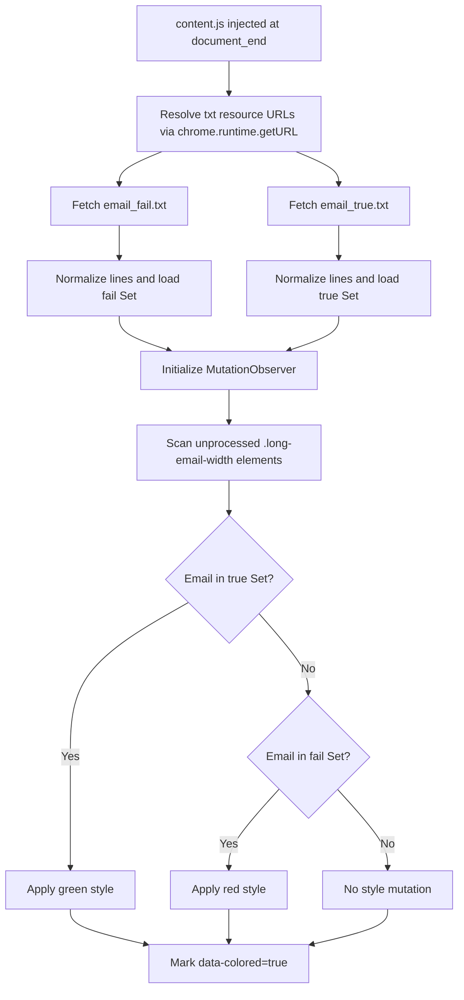

# Snov.io Status Highlighter

A zero-backend, runtime email-status highlighting library for Snov.io workflows that marks replied and failed contacts directly in the UI with deterministic matching.

[](manifest.json)
[](manifest.json)
[](LICENSE)
[](#testing)
[](#testing)

> [!NOTE]
> This project is packaged as a Chrome Extension content script, but the core runtime behavior is intentionally library-like: load two datasets, normalize input, and apply deterministic rule-based highlighting.

## Table of Contents

- [Features](#features)
- [Tech Stack & Architecture](#tech-stack--architecture)
- [Getting Started](#getting-started)
- [Testing](#testing)
- [Deployment](#deployment)
- [Usage](#usage)
- [Configuration](#configuration)
- [License](#license)
- [Contacts & Community Support](#contacts--community-support)

## Features

- Real-time status classification over live Snov.io DOM updates using `MutationObserver`.
- Dual-source status ingestion via plain-text datasets:
  - `email_fail.txt` for failed/deliverability-risk emails.
  - `email_true.txt` for replied/positive-state emails.
- O(1) membership checks by pre-loading both datasets into in-memory `Set` collections.
- Stable normalization pipeline (`trim() + toLowerCase()`) to avoid false negatives caused by case or spacing variance.
- Deterministic conflict precedence where reply status overrides fail status when an email appears in both sets.
- No external API dependencies, no backend process, and no telemetry pipeline.
- Scope isolation to `https://app.snov.io/*` through Chrome Manifest V3 host constraints.
- Debounced mutation handling to reduce unnecessary DOM traversals under heavy UI re-rendering.
- Idempotent marking using `data-colored="true"` to prevent repeated styling work.
- Lightweight operational model suitable for high-volume outbound operations teams.

> [!IMPORTANT]
> The extension only highlights email nodes matching the selector `.long-email-width` and only within Snov.io pages that satisfy the configured host permissions.

## Tech Stack & Architecture

### Core Stack

- Language: Vanilla JavaScript (ES6).
- Runtime: Browser content script.
- Packaging: Chrome Extension Manifest V3.
- Data format: newline-delimited plaintext (`.txt`).
- Browser APIs: `fetch`, `MutationObserver`, DOM query APIs, `chrome.runtime.getURL`.

### Project Structure

```text
.
├── content.js          # Runtime logic: load datasets, observe DOM, apply highlights
├── manifest.json       # Extension metadata, match rules, resource exposure
├── email_fail.txt      # Failed email dataset (one email per line)
├── email_true.txt      # Replied email dataset (one email per line)
├── emails.txt          # Additional local list (not used by runtime)
├── icons/
│   └── icon128.png     # Extension icon
├── LICENSE             # GNU GPL v2
└── README.md           # Project documentation
```

### Key Design Decisions

- Dataset-driven architecture: status logic is data-configured rather than hardcoded.
- Runtime normalization first: convert all loaded and observed addresses to canonical lowercase form.
- Preload before observe: initialize both sets before activating mutation tracking to avoid transient mismatches.
- Selector-scoped execution: only process candidate nodes that have not been marked before.
- Debounced observer callback: absorb bursty DOM mutation streams without over-processing.

### Logging/Highlighting Data Flow



> [!TIP]
> If your status lists are large, keep one email per line and avoid duplicates; using `Set` already de-duplicates data at load time.

## Getting Started

### Prerequisites

- Google Chrome (recommended latest stable).
- Access to `https://app.snov.io/*`.
- `git` installed locally.
- Optional: Node.js 18+ if you want to run syntax checks via CLI.

### Installation

```bash
# 1) Clone repository
git clone https://github.com/OstinUA/Snov.io-addon_1.git
cd Snov.io-addon_1

# 2) Populate datasets (one email per line)
$EDITOR email_fail.txt
$EDITOR email_true.txt

# 3) Load unpacked extension in Chrome
# - Open chrome://extensions/
# - Enable Developer mode
# - Click "Load unpacked"
# - Select this repository root
```

> [!WARNING]
> Keep `email_fail.txt` and `email_true.txt` in repository root. Runtime loading depends on static paths resolved by `chrome.runtime.getURL(...)`.

## Testing

Because this project is a static extension (no dedicated test framework yet), use the following validation workflow:

```bash
# Syntax check content script
node --check content.js

# Validate JSON manifest format
python3 -m json.tool manifest.json > /dev/null

# Optional: inspect tracked files and extension package readiness
git status --short
```

Recommended manual integration test:

1. Add known addresses to both lists (`email_fail.txt`, `email_true.txt`).
2. Reload extension in `chrome://extensions/`.
3. Open Snov.io lead pages containing those addresses.
4. Confirm replied emails render green, failed emails red.
5. Confirm replied precedence when an address exists in both lists.

> [!CAUTION]
> If Snov.io changes class names or DOM structure, selector `.long-email-width` may become stale and require an update in `content.js`.

## Deployment

### Production Deployment Model

This repository is deployed as an unpacked extension (internal usage) or a packaged Chrome extension artifact.

### Build/Package Steps

```bash
# Optional clean package directory build
rm -rf dist && mkdir -p dist/snov-status-highlighter
cp -R content.js manifest.json email_fail.txt email_true.txt icons LICENSE README.md dist/snov-status-highlighter/

# Create distributable zip
cd dist && zip -r snov-status-highlighter.zip snov-status-highlighter
```

### CI/CD Integration Suggestions

- Add a CI job to run `node --check content.js` and `python3 -m json.tool manifest.json`.
- Add artifact packaging step to produce `snov-status-highlighter.zip`.
- Gate release tags on successful syntax and manifest validation.

## Usage

Use this project as a deterministic status-highlighting runtime in Snov.io.

```js
// content.js executes automatically as a content script on app.snov.io pages.
// 1) It loads both datasets into Sets.
// 2) It scans .long-email-width elements.
// 3) It applies styles based on status precedence.

if (trueEmails.has(emailText)) {
  // replied status has top priority
  el.style.backgroundColor = '#7dff7d';
} else if (failEmails.has(emailText)) {
  // fail status applies when reply status is absent
  el.style.backgroundColor = '#f65353';
}

// avoid reprocessing the same element repeatedly
el.dataset.colored = 'true';
```

Operational workflow:

1. Update `email_fail.txt` and `email_true.txt`.
2. Reload the extension.
3. Refresh Snov.io page.
4. Verify UI highlights.

## Configuration

### Configuration Surface

| Option | Type | Default | Description |
|---|---|---|---|
| `host_permissions` | `string[]` | `https://app.snov.io/*` | Restricts where content script can execute. |
| `content_scripts.matches` | `string[]` | `https://app.snov.io/*` | URL patterns for script injection. |
| `content_scripts.run_at` | `string` | `document_end` | Injection lifecycle timing. |
| `email_fail.txt` | file | empty | Newline-delimited fail-status email list. |
| `email_true.txt` | file | empty | Newline-delimited reply-status email list. |
| `.long-email-width` selector | CSS selector | hardcoded | Target email nodes for classification/styling. |

### Environment Variables

No `.env` file or runtime environment variables are required.

### Startup Flags

No CLI startup flags are required.

### Data File Contract

- One email per line.
- Empty lines are ignored.
- Matching is case-insensitive.
- Duplicate entries are collapsed by `Set` semantics.

## License

Distributed under the GNU General Public License v2.0. See `LICENSE` for full terms.

## Contacts & Community Support

## Support the Project

[](https://www.patreon.com/OstinFCT)
[](https://ko-fi.com/fctostin)
[](https://boosty.to/ostinfct)
[](https://www.youtube.com/@FCT-Ostin)
[](https://t.me/FCTostin)

If you find this tool useful, consider leaving a star on GitHub or supporting the author directly.
